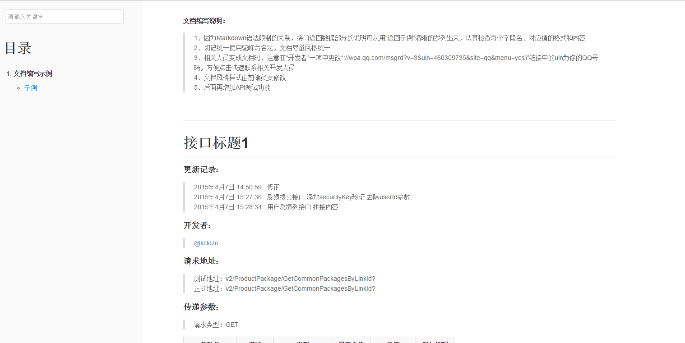

# A very simple api document producer by markdown

## How to use
    * cd www(web root path) and git clone https://github.com/ycf-php/apidoc.git
    * open your browser, http::/your-server/apidoc/index.html
    * add or eidt api doc like demo.md
    * change tree list,please refer to all.md
    * if you need search in document,have to run in linux and PHP env

## Demo

